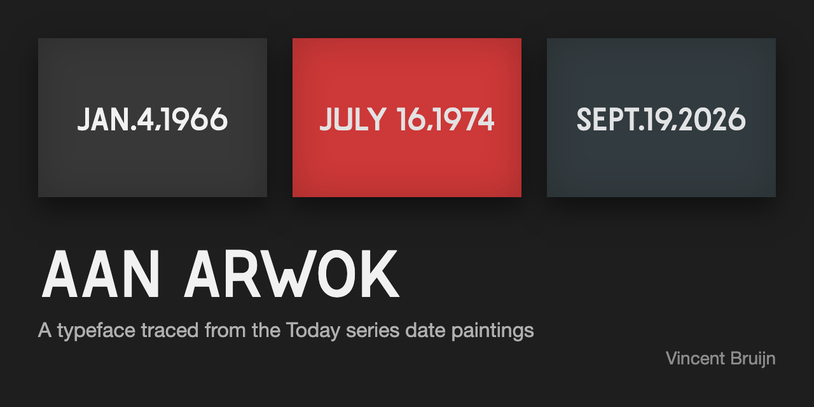

# On Kawara font face

Tracing a lot of images of "date paintings" from On Kawara's "Today" series, I've created a font
as complete as possible. I couldn't find images with a "H", "Q", "W" or "X" so those will be
designed in relation to the available letters.

Originally made with Glyphs Mini; now built and kerned with an open-source toolchain
(glyphsLib + ufo2ft + fontTools) — Glyphs Mini is no longer needed. `kawara2.glyphs`
is the source of truth; `OnKawara-Regular.otf` is compiled from it.

https://glyphsapp.com/tutorials/kerning
https://www.schoolofmotion.com/blog/custom-font-illustrator-fontforge

## Building the font

One-time setup (needs Python 3):

    make setup

Compile `kawara2.glyphs` to `OnKawara-Regular.otf` (repo root + `www/`), including
all kerning as a GPOS table, and refresh the generated `www/kerning.js` and
`www/glyphdata.js` that the browser tools read:

    make build

A rebuild without source changes still touches both OTFs (they embed a build
date); `git checkout -- OnKawara-Regular.otf www/OnKawara-Regular.otf` drops that.

## Kerning workbench

Fine-tune kerning in the browser — no font editor required:

    make kern

then open <http://localhost:8765/kern.html>. Type any sample text (or pick a preset),
click between two letters and nudge with the arrow keys (↑/↓ ±10, ⇧ ±50, ⌥ ±1;
←/→ walks through the pairs). "sync case" keeps all four case combinations of a
letter pair identical, since the lowercase glyphs are component copies of the capitals.
**= 0** stores an explicit zero — the pair is settled and drops out of the gap report
(`make gaps`) — while **✕ pair** removes the pair entirely (back to "unconsidered").
Hitting **Save** writes the pairs back into `kawara2.glyphs` and rebuilds the OTF in
place — toggle "font's own kerning" to proof the baked-in result.

Without the local server (e.g. the page hosted statically), **Save** downloads a
`kerning.json` instead; apply it with:

    make apply FILE=kerning.json

Check for pairs whose case combinations disagree:

    make audit

List every pair that has no kerning yet, grouped by left-hand glyph, in
[KERNING_CHECK.md](KERNING_CHECK.md):

    make gaps

## Glyph editor

The same server hosts a small outline editor at <http://localhost:8765/glyphed.html>
(`make kern` starts it; the header links both pages). Pick a glyph from the list,
drag points, double-click an outline to insert a point, ⌥-double-click a straight
segment to turn it into a curve, ⌫ to delete a point or a pair of handles, and
arrow keys to nudge (⇧ ×10). ⌘Z undoes, **Revert** returns to the last save.
The strip at the bottom sets a sample text with the current kerning.
**Save** writes the glyph's outline and width into `kawara2.glyphs` and rebuilds
the OTF. Component glyphs (the lowercase copies of the capitals) are shown
ghosted and edited through their capital.

Without the server, **Save** downloads a `glyph-NAME.json`; apply it with:

    make apply-glyph FILE=glyph-NAME.json

## Development

- `tools/` — the build script, the kerning and outline read/write modules
  (they edit `kawara2.glyphs` as text, so unrelated bytes never change) and
  the local server
- `www/` — the specimen pages (`index.html`, `text.html`), the kerning
  workbench and the glyph editor; `kerning.js` and `glyphdata.js` are generated
- `tests/` — unit tests for the tools and end-to-end tests that drive the
  server over HTTP; they work on temporary copies and never write to
  `kawara2.glyphs`. The release workflow runs them before building.

Run the tests:

    make test

## Color variants

Date painting color variants
white on gray: #f1f1f1 on #383838
white on red: #e2e2e2 on #cd3838
white on greenish: #e2e3e4 on #323b3f

## Sentences with all alphabet characters

Jack amazed a few girls by dropping the antique onyx vase!
THE QUICK BROWN FOX, JUMPS OVER THE LAZY DOG.

(c) 2018 ax710.org, y-a-v-a.org
